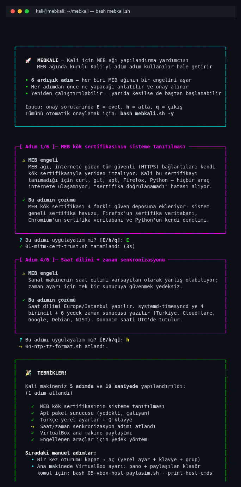

# mebkali

Okul ağında kullanılan bir Kali makinesi taze kurulduğunda, internete bağlansa bile pek çok aracı çalışmaz hale gelir: tarayıcı sertifika hatası verir, `apt` paket indiremez, `git clone` başarısız olur, Python betikleri yarıda kesilir. Bunun nedeni MEB ağının internet trafiğini denetlemek için arada durup TLS bağlantılarını kendi sertifikasıyla yeniden imzalamasıdır. Bu sorunları el ile tek tek çözmek hem zaman alıcı hem de ileride yeni bir makine kurulduğunda her şeyi baştan tekrar yapmak gerekir.

**mebkali**, Kali makinesini bu ortamda kullanılır hale getirmek için gereken her şeyi **12 adımda** otomatik yapan bir yardımcı betiktir. İlk 5 adım MEB ağ engellerini çözer (kök sertifika, apt mirror, Türkçe yerel + Q klavye, saat, VirtualBox paylaşımı). Sonraki 7 adım sınıf VM'i için ders ortamını kurar: ekran kilidi gevşetmesi, Docker tabanlı yerel zafiyetli laboratuvar (DVWA), Türkçe alias seti, Türkçe `yardim` komutu, ilk açılışta öğrenci kimliği sorgusu (hostname + filigran), gereksiz servislerin kapatılması (4 GB RAM tuning + earlyoom) ve yasal/etik çerçeve (masaüstü filigranı + ETIK-CERCEVE.pdf). Her adımdan önce ne yapılacağını ve hangi engeli aştığını size anlatır, ardından onayınızı alır; istediğiniz adımı atlayabilir, betiği yarıda kesip daha sonra kaldığınız yerden devam edebilirsiniz.



## Yükleme

> **Tavuk-yumurta sorunu**: Kali makinesi MEB ağında ilk açıldığında genellikle internete bağlanamaz — `mebkali` zaten bu sorunu çözmek için var. Bu yüzden indirmeyi **internete erişebilen başka bir bilgisayardan** yapıp dosyaları sanal makineye taşımak gerekir.

### 1. İnternete erişebilen bir bilgisayardan ZIP'i indirin

Doğrudan bağlantı (tarayıcıdan veya `curl` ile):

```
https://github.com/enseitankado/mebkali/archive/refs/heads/main.zip
```

Yayınlanmış sürümü tercih ederseniz: <https://github.com/enseitankado/mebkali/releases/latest>

### 2. ZIP'i Kali sanal makinesine aktarın

İki yöntemden biri:

**A) USB bellek ile** *(en güvenilir, her durumda çalışır)*
1. ZIP'i USB belleğe kopyalayın.
2. USB'yi takın; VirtualBox üst menüsünden **Aygıtlar → USB → \<USB markası\>** seçerek belleği VM'e bağlayın.
3. Kali içinde dosya yöneticisinden USB'yi açın, ZIP'i ev dizininize kopyalayın, sağ tıkla → **Buraya çıkar**.

**B) Sürükle-bırak ile** *(daha hızlı; VirtualBox Guest Additions kuruluysa çalışır — Kali ISO'ları çoğunlukla kurulu gelir)*
1. VirtualBox menüsünden **Aygıtlar → Sürükle ve Bırak → Yalnızca Konuğa** seçin.
2. ZIP'i ana makineden Kali masaüstüne sürükleyin, sağ tıkla → **Buraya çıkar**.

> Sürükle-bırak çalışmazsa endişelenmeyin — A yolunu kullanın.

### 3. Çıkardığınız klasöre girip betiği çalıştırın

```bash
cd ~/mebkali-main           # ZIP'in çıktığı klasör
bash mebkali.sh             # her adımda E/h/q onayı
bash mebkali.sh -y          # tüm adımlar onaysız (otomatik evet)
```

> **Sudo şifresi**: Varsayılan `kali`. Farklıysa `SUDO_PASS=<şifre> bash mebkali.sh`.

Onay sorgusunda:
- `E` (varsayılan) — adımı uygula
- `h` — atla
- `q` — buraya kadar olanları bırak ve özetle çık

Betikler **yeniden çalıştırılabilir**: yarıda keserseniz veya tekrar çalıştırırsanız zarar vermez; daha önce kurulmuş bir şeyi tekrar kurmaz.

> Kali'de internet zaten çalışıyorsa (örn. ev ağı): `git clone https://github.com/enseitankado/mebkali.git && cd mebkali && bash mebkali.sh` yeterlidir.

## Çözdüğü problemler

| # | Adım | Aşılan engel |
|---|---|---|
| 1 | `01-mitm-cert-trust.sh` | MEB kök sertifikasını **4 ayrı güven deposuna** ekler: sistem geneli sertifika havuzu, Firefox sertifika veritabanı, Chromium sertifika veritabanı, Python'un kendi denetimi. Python'un katı sertifika kontrolü için paket güncellemelerinden etkilenmeyecek bir yama bırakır. |
| 2 | `02-apt-mirror-fix.sh` | Varsayılan paket sunucusu yanıt vermediğinde, **11 yedekli sunucu** arasından çalışan ilkine geçer. Yapılandırma yedeklenir; bir sorun çıkarsa otomatik geri alınır. |
| 3 | `03-turkce-locale-keyboard.sh` | Türkçe yerel ayarları (`tr_TR.UTF-8`) ve Türkçe Q klavyeyi **3 katmanda** kurar: terminal (TTY), grafik ortam (X11) ve oturum açma ekranı (LightDM). |
| 4 | `04-ntp-tz-format.sh` | Saat dilimini `Europe/Istanbul` yapar; zaman senkronizasyonu için **4 birincil + 6 yedek** sunucu yazar. Donanım saati UTC'de tutulur (Windows ile çift kurulumda saat karışmaz); ekran saati 24 saat biçiminde. |
| 5 | `05-vbox-host-paylasim.sh` | Sanal makine ile ana bilgisayar arasında dosya ve pano paylaşımını hipervizör IPC üzerinden hazırlar — paketler ağdan hiç çıkmaz, MEB'in görüş alanı dışındadır. |
| 6 | `06-ders-ortami.sh` | Ekran kilidi (`xfce4-screensaver`) kapatılır, güç yönetimi (`xfce4-power-manager`) DPMS/blank/sleep süreleri sıfırlanır, `systemd-logind` laptop kapağına karşı pasifleştirilir — 40 dk'lık derste şifre yazılmaz, demo ekranı kararmaz. Geri alma: `--revert`. |
| 7 | `07-zafiyetli-lab.sh` | Docker'ı kurar, `vulnerables/web-dvwa` imajını çeker (~700 MB, sonrasında offline çalışır), 127.0.0.1:8080'de DVWA konteyneri ve **`mebkali-lab`** start/stop/sifirla/ac komutu + masaüstü kısayolu üretir. |
| 8 | `08-shell-welcome.sh` | **29 Türkçe alias** (liste, kopyala, tasi, bul, ara, tara, kabuk, guncelle…) bash ve zsh'a `/etc/profile.d/` + `/etc/bash.bashrc` + `/etc/zsh/zshrc` üzerinden yüklenir. |
| 9 | `09-manpages-tr.sh` | `manpages-tr` + `tldr` kurar; **`yardim`** komutu sırayla tldr (tr) → man -L tr → tldr (en) → man → --help dener. `yardim nmap`, `yardim ls` ile Türkçe açıklama. |
| 10 | `10-sinif-kimlik.sh` | İlk grafiksel girişte **zenity** diyaloğu öğrenci ad-soyad / sınıf / dönem sorar → hostname `s-ahmet-12sg2`, `/etc/motd`, `/etc/mebkali/kimlik.conf` (shell hoşgeldin ve conky filigranı buradan okur). Yeniden açmak: `mebkali-kimlik --force`. |
| 11 | `11-servisleri-kapat.sh` | `cups`, `bluetooth`, `ModemManager`, `avahi-daemon` durdurulup mask'lenir; `vm.swappiness=10`, `vm.vfs_cache_pressure=50`; **`earlyoom`** agresif eşiklerle (RAM %10/%5) kurulur — Firefox+Burp+msfconsole birlikte açılınca VM donmasın. |
| 12 | `12-etik-banner.sh` | Sağ-üstte sürekli görünür **conky filigranı** (öğrenci kimliği + TCK 243/244/KVKK/5651 uyarısı) + `/usr/share/mebkali/ETIK-CERCEVE.{pdf,html}` (wkhtmltopdf → pandoc+weasyprint → paps fallback) + masaüstü kısayolu. |

## Adım betikleri tek başına çalışır

`mebkali.sh` yönetici betikten bağımsız olarak her adım tek başına çalıştırılabilir:

```bash
sudo bash 01-mitm-cert-trust.sh
sudo bash 02-apt-mirror-fix.sh
sudo bash 05-vbox-host-paylasim.sh --print-host-cmds
```

## Kurulduktan sonra manuel adımlar

- **Oturumu kapat → aç** (yerel ayar, klavye düzeni ve `docker` grup üyeliğinin yeni oturuma yansıması için).
- **Ana makinede VirtualBox**: GUI'den iki yönlü pano + paylaşılan klasörü tanımla — komutlar:

  ```bash
  bash 05-vbox-host-paylasim.sh --print-host-cmds
  ```

- **İlk grafiksel girişte** sınıf kimliği diyaloğu açılır (ad-soyad / sınıf / dönem). Tek seferlik; sonra sessiz.
- **Zafiyetli laboratuvarı başlat**: `mebkali-lab basla` → tarayıcıdan `http://127.0.0.1:8080/setup.php` → *Create / Reset Database*.

## Sınıf VM kullanım sözlüğü (8-12. adım sonrası)

| Komut | Yapar |
|---|---|
| `mebkali-kimlik` | Kimliği yeniden kaydeder (varsa zaten sessiz). `--force` ile her zaman sorar. |
| `mebkali-lab basla / durdur / sifirla / ac / durum` | DVWA konteynerini yönetir. |
| `yardim <komut>` | Türkçe öncelikli komut açıklaması (tldr-tr → man-tr → tldr → man). |
| Türkçe alias örnekleri | `liste`, `listele`, `kopyala`, `tasi`, `sil`, `bul`, `ara`, `temizle`, `guncelle`, `tara`, `kabuk`, `aramotor`, `portlar`, `bagli`… |

## Kimler için

`mebkali`, **MEB MITM güvenlik duvarı** (veya benzer kurum proxy/MITM altyapısı) arkasında Kali Linux çalıştırması gereken her ortamda işe yarar. Hedef kitle:

### Mesleki ve Teknik Anadolu Liseleri (MTAL) — Bilişim Teknolojileri Alanı

Kali Linux ve sızma testi araçları MTAL çerçeve öğretim programlarında doğrudan **Bilişim Teknolojileri Alanı**nda geçer. Alan içindeki dağılım:

- **Siber Güvenlik dalı** — *Siber Güvenlik Temelleri*, *Sızma Testleri*, *Sistem ve Ağ Güvenliği*, *Web Uygulama Güvenliği*, *Adli Bilişim* derslerinin uygulama kısmı tamamen Kali üstünde işlenir. **(birincil hedef kitle)**
- **Ağ İşletmenliği ve Siber Güvenlik dalı** — *Ağ Güvenliği*, *Saldırı Tespit ve Önleme* modüllerinde Kali yoğun kullanılır.
- **Web Programcılığı dalı** — *Web Uygulama Güvenliği* dersinde Burp Suite, sqlmap, OWASP ZAP gibi Kali araçları doğal ortam.
- **Bilgisayar Teknik Servisi dalı** — *Adli Bilişim Temelleri* ve sistem analizi konularında Autopsy, foremost, hashcat kullanılır.
- **Bulut Bilişimi dalı** ve **Yapay Zeka Uygulamaları dalı** — bulut güvenliği seçmeli modüllerinde Kali ortam olarak geçer.

Şu an Türkiye genelinde Bilişim Teknolojileri Alanı **200'den fazla MTAL**de açık; Siber Güvenlik dalı her yıl yeni okullara yayılıyor. Sınıflarda öğrenci başına bir Kali sanal makinesi kurulduğunda her seferinde MEB MITM ayarlarıyla manuel uğraşmak yerine bu betik çalıştırılır.

### Üniversite önlisans ve lisans programları

Aynı tür kurum proxy/MITM problemi üniversite kampüs ağlarında da yaşanır. Kali yoğun kullanılan programlar:

- **Önlisans**: Siber Güvenlik, Bilgi Güvenliği Teknolojisi, Bilgisayar Programcılığı, Ağ Teknolojileri, Adli Bilişim Teknolojileri.
- **Lisans**: Siber Güvenlik (Mühendislik/Teknoloji), Adli Bilişim Mühendisliği, Bilgisayar Mühendisliği'nin ağ/güvenlik seçmelileri, Bilgi Güvenliği yüksek lisansı.

### Diğer kurumlar

- **Halk Eğitim Merkezleri (HEM)** ve **Mesleki Eğitim Merkezleri (MEM)** — siber güvenlik kursları açanlar (özellikle Bilişim Teknolojileri Alanı sertifika programları).
- **Bilişim Teknolojileri Vadisi**ndeki ar-ge laboratuvarları, **TÜBİTAK BİLGEM** eğitim programları, **STM ThinkTech** atölyeleri — kurum ağına bağlanan stajyer/kursiyer makinelerinde benzer MITM/proxy sorunları görülür.
- **Belediye akıllı kent eğitim merkezleri** ve **gençlik merkezleri** — siber güvenlik atölyeleri yapan birimler (örn. İBB, ABB Bilim Merkezleri).
- **Özel kurslar**: BTK Akademi yüz yüze etkinlikleri, Cyberpark eğitim sağlayıcıları, mesleki sertifika veren özel akademiler.
- **CTF takımları ve yarışma kampları** — okul/üniversite ağlarında prova çalışması yapan takımlar.

> Kurumunuzun ağında Kali kullanırken benzer bir MITM/proxy sorunuyla karşılaşıyorsanız (kök sertifikanız `fatihca` olmasa bile), `01-mitm-cert-trust.sh` içindeki sertifika dosyasını kendi kurum kökünüzle değiştirip aynı betiği kullanabilirsiniz. Adımların geri kalanı zaten kuruma özel değildir.

## Lisans

MIT — bkz. `LICENSE`.

## Sorumluluk reddi

Bu repo, *yetkili* eğitim ortamlarında kullanılmak üzere hazırlanmıştır. MEB kök sertifikasını sisteme kurmak, MEB ağında yapılan TLS bağlantılarınızın MEB tarafından gözlemlenebileceğini kabul ettiğiniz anlamına gelir. Hassas işlemler (bankacılık, kişisel hesaplar) için bu makineyi MEB ağında kullanmayın.
